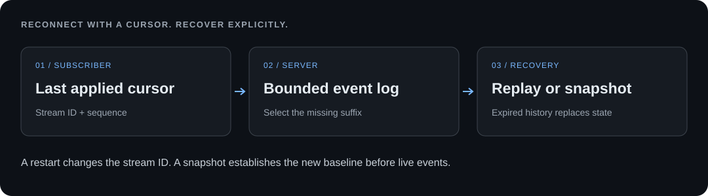

# Event Replay Lab

**Reconnect a subscriber without guessing what happened while it was away.**

[Português](README.pt.md) · [Tests](https://github.com/OAtumFresco/event-replay-lab/actions/workflows/test.yml) · [Rui Andrade](https://github.com/OAtumFresco)

A small Server-Sent Events server and browser projection with a bounded history. Disconnect the subscriber while the server keeps changing. Reconnect within the retained window to replay missing events; reconnect later to replace the projection with a current snapshot.



## Run locally

Requires **Node.js 22.13+**. No npm dependencies, database or external service.

```sh
git clone https://github.com/OAtumFresco/event-replay-lab.git
cd event-replay-lab
npm start
```

Open **http://127.0.0.1:4179**. `LAB_PORT` can override the port.

```sh
npm run check
npm test
```

## Two recovery paths

1. Click **Disconnect subscriber**, then **Add one event** three times. The server value becomes 3 while the subscriber remains at 0.
2. Click **Reconnect subscriber**. The client receives events 1, 2 and 3, in order.
3. Disconnect again and click **Add 25 events**. The log retains only the most recent 20.
4. Reconnect. The client receives one `history-expired` snapshot at the current sequence instead of trying to reconstruct an incomplete history.
5. Restart the server while subscribed. A new stream identifier makes the previous cursor obsolete. The browser receives a `stream-changed` snapshot; the in-memory counter resets to zero.

## Protocol

Each cursor has the form `stream-id:sequence`. The stream ID changes on server restart; sequence numbers are monotonic within that process lifetime.

```text
event: increment
id: example-stream:3
data: {"stream":"example-stream","sequence":3,"value":3,"delta":1}

```

The server sends an initial snapshot and then live increments. A reconnect uses the browser's `Last-Event-ID` header, which takes precedence over the manual reconnect query parameter. Heartbeat comments keep an idle stream active without advancing its cursor.

| Cursor condition | Server response |
| --- | --- |
| None | Initial snapshot, then live events |
| Within retained history | Only events after that sequence, then live events |
| Exactly one before the oldest retained event | Full missing suffix; no unnecessary snapshot |
| Older than available history | Current snapshot with `history-expired` |
| From another process lifetime | Current snapshot with `stream-changed` |
| Malformed or ahead of the server | Explicit recovery snapshot |

The browser ignores already-applied sequences, validates event IDs and totals, and requests a fresh snapshot on a gap. Applying a snapshot replaces state; it does not run the side effects of missing events.

## Implementation decisions

- [`src/log.js`](src/log.js) retains 20 immutable frames. Replay selection and subscriber registration run synchronously in one process, so an HTTP append cannot slip into the handover.
- [`src/sse.js`](src/sse.js) writes SSE frames, sends heartbeat comments and releases listeners on disconnect. If a consumer causes backpressure, its connection closes so it can reconnect; the server does not keep an unbounded per-client queue.
- [`public/model.js`](public/model.js) is a transport-independent projection reducer with duplicate, gap and snapshot validation.
- [`src/server.js`](src/server.js) caps subscriptions at 64, restricts the demo to loopback origins and provides a fixed increment action.

Tests exercise retained-history boundaries, previous stream IDs, duplicate delivery, inconsistent totals, real HTTP reconnects, header precedence, connection caps and slow-client cleanup. See the [verification protocol](docs/verification.md).

## Scope and tradeoffs

This is a **single-process, in-memory state projection**, not a durable message broker. Restarting resets both history and state. Several server instances would need a shared ordered log and a coordinated stream identity. A snapshot can restore the current counter but cannot recover every expired event or replay an external side effect.

The fixed POST action is deliberately not idempotent: the UI does not retry writes automatically and reports an uncertain outcome when a response is lost. The separate [Offline Sync Lab](https://github.com/OAtumFresco/offline-sync-lab) explores that problem.

The server has no authentication, tenant isolation, durable offsets or production load validation. It binds to loopback and is not prepared for public hosting. The subscriber state lives in memory; reloading the page requests a new snapshot. Native EventSource may reconnect automatically; delivery is not exactly once.

## References and availability

Built from public [Server-Sent Events semantics](https://developer.mozilla.org/en-US/docs/Web/API/Server-sent_events/Using_server-sent_events), using the [Node HTTP API](https://nodejs.org/api/http.html). This independent example contains no game rules, product source code or customer data.

No open-source license has been assigned. See [NOTICE](NOTICE). [Contact Rui Andrade](https://ratecnologias.cv/#contacto).
